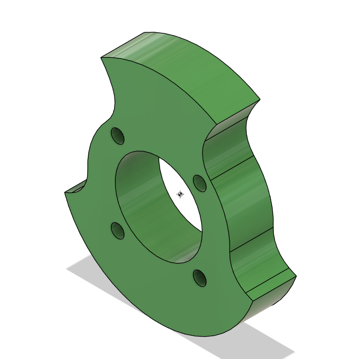
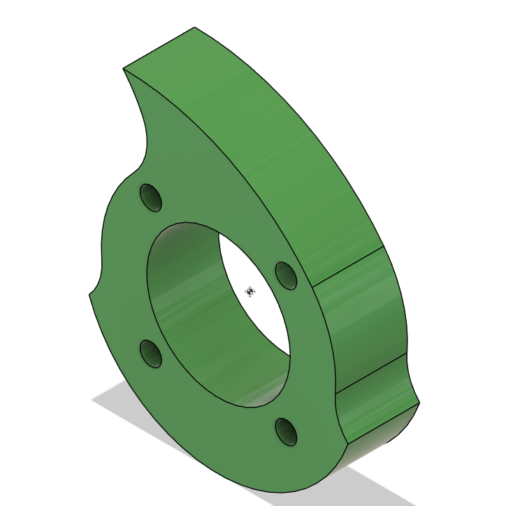
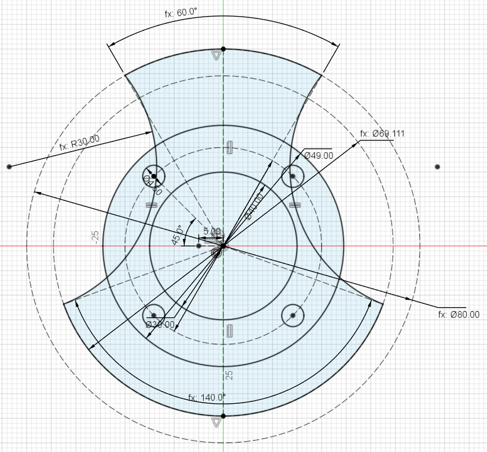

# Centre-of-Mass Balancer for Fusion 360

A Fusion 360 script that adjusts one sketch parameter until the centre of mass of a body lies on the centre of a sketch circle.

  
  

  

## What it does

The script changes a user parameter and rebuilds the model until the body's centre of mass sits on the centre of a target circle in the sketch. It then leaves the parameter at that value.

## Requirements

- One solid body in one component, extruded from the sketch
- A user parameter that drives the sketch (in the example, `RadiusS`; see [parameters.csv](parameters.csv))
- A circle in the sketch marking the target centre

## Installation

1. Create a folder named `com_balancer` and put `com_balancer.py` in it.
2. In Fusion 360, open **Utilities → Scripts and Add-Ins**.
3. Click **+** next to *My Scripts* and select the folder.

## Usage

1. Open the design.
2. Run `com_balancer` from **Scripts and Add-Ins**.
3. Check the pre-flight dialog and click **Yes**.
4. Read the final report. The parameter is now set to the balanced value.

## Settings

The settings are at the top of `com_balancer.py`.

| Setting | Default | Purpose |
|---|---|---|
| `PARAM_NAME` | `'RadiusS'` | Parameter to adjust |
| `SKETCH_NAME` | `''` | Sketch to use (`''` = the sketch with the most profiles) |
| `BODY_NAME` | `''` | Body to use (`''` = the only body in the component) |
| `TARGET_CIRCLE_DIA_MM` | `None` | Target circle (`None` = the circle closest to the sketch origin, or a diameter in mm) |
| `RANGE_FRACTION` | `0.45` | Search range, ± this fraction of the current value |
| `CONFIRM_BEFORE_RUN` | `True` | Show the pre-flight dialog |

## Notes

- Extrusion thickness does not affect the result. It only moves the centre of mass along the extrusion axis, to mid-thickness.
- If the sketch is on the XZ plane, the Properties dialog shows the centre of mass at Y = ± half the thickness. This is expected.
- The script only corrects the offset perpendicular to the split line. The other in-plane offset should be zero if the sketch is symmetric.
- If the solve fails, the parameter is restored to its original value.

## Purpose

The script is created to help design spinner-type assymetric weapons for battlebots tournaments.

## License

MIT - see [LICENSE](LICENSE). Free to use, modify and share.

If you use this script in a project, video or publication, a mention or a link back would be appreciated.